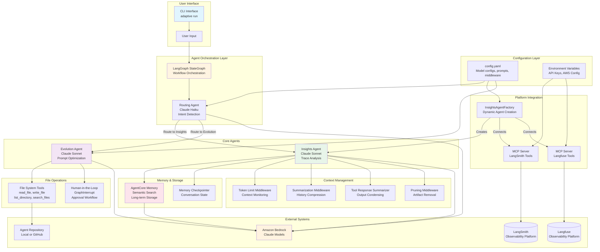
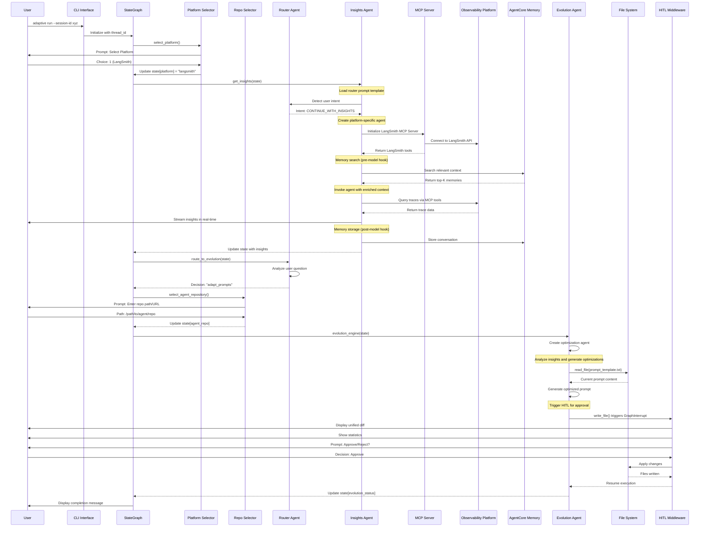
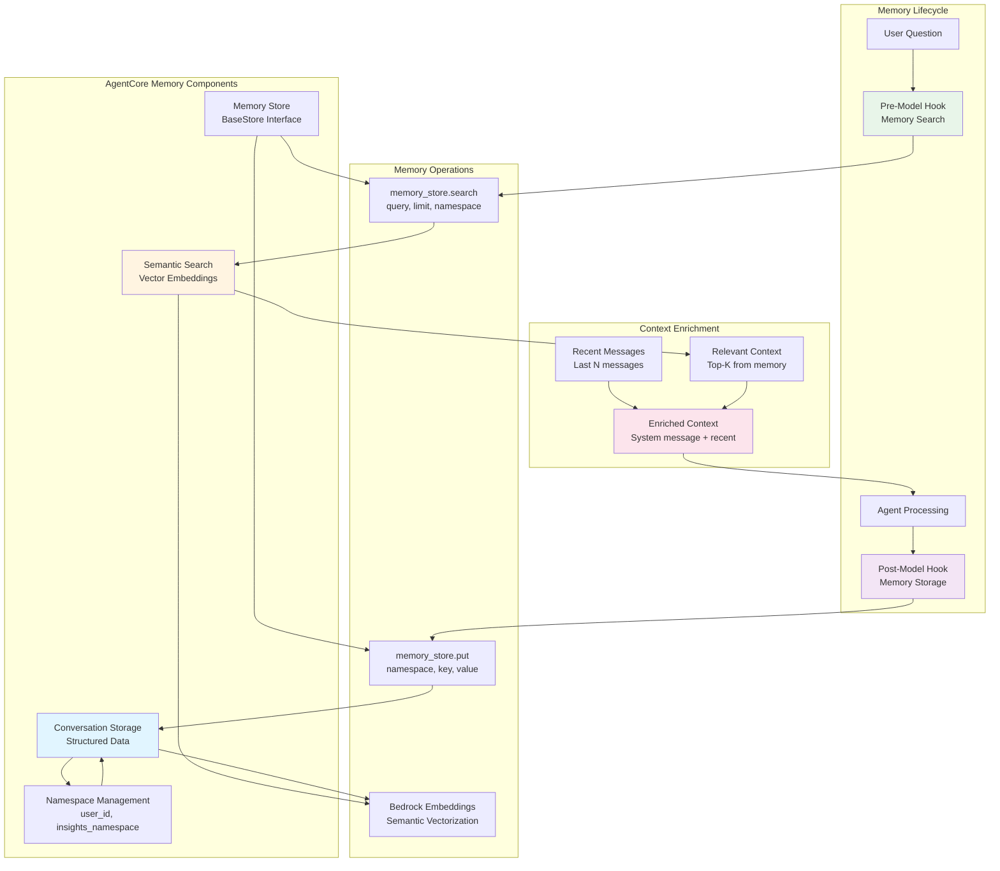
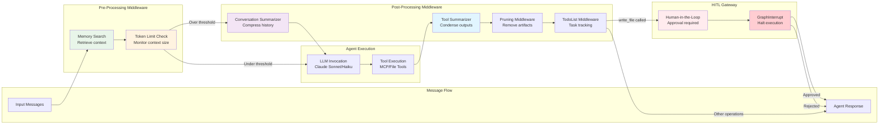
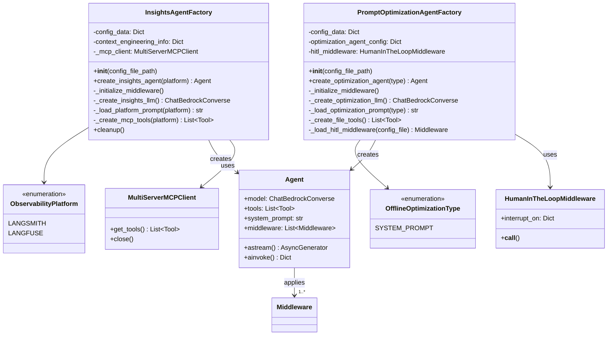
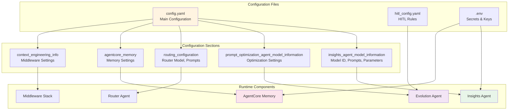

# Self-Healing Agent Architecture Diagrams

## System Architecture Overview

## Workflow State Machine

```mermaid
stateDiagram-v2
    [*] --> START
    START --> SelectPlatform: Initialize Session

    SelectPlatform --> GetInsights: Platform Selected<br/>(LangSmith/Langfuse)

    state GetInsights {
        [*] --> DetectIntent: User Question
        DetectIntent --> SkipInsights: Evolution Intent Detected
        DetectIntent --> GenerateInsights: Analysis Intent Detected

        GenerateInsights --> MemorySearch: Search AgentCore Memory
        MemorySearch --> CreateAgent: Create Platform-Specific Agent
        CreateAgent --> InvokeAgent: Invoke with Context
        InvokeAgent --> StreamResponse: Stream Results
        StreamResponse --> StoreMemory: Store in AgentCore Memory
        StoreMemory --> [*]

        SkipInsights --> [*]: Skip to Evolution
    }

    GetInsights --> RouteToEvolution: Insights Generated

    state RouteToEvolution {
        [*] --> AnalyzeIntent: Check User Question
        AnalyzeIntent --> CheckMarker: Check Special Marker
        CheckMarker --> ToEvolution: Evolution Needed
        CheckMarker --> ToEnd: No Evolution Needed
    }

    RouteToEvolution --> SelectRepo: Route to Evolution
    RouteToEvolution --> END: End Workflow

    SelectRepo --> EvolutionEngine: Repository Selected

    state EvolutionEngine {
        [*] --> LoadInsights: Load Analysis Results
        LoadInsights --> CreateOptAgent: Create Optimization Agent
        CreateOptAgent --> GenerateOptimizations: Analyze & Propose Changes
        GenerateOptimizations --> GraphInterrupt: Trigger HITL Review

        state GraphInterrupt {
            [*] --> ExtractPayload: Extract Change Request
            ExtractPayload --> GenerateDiff: Create Unified Diff
            GenerateDiff --> DisplayPatch: Show Changes to User
            DisplayPatch --> AwaitApproval: Request Decision
            AwaitApproval --> Approved: User Approves
            AwaitApproval --> Rejected: User Rejects

            Approved --> ApplyChanges: Write Files
            Rejected --> DiscardChanges: No Changes Made
        }

        GraphInterrupt --> [*]: Changes Applied/Rejected
    }

    EvolutionEngine --> END
    END --> [*]

    note right of SelectPlatform
        Platform selection persists
        for entire session
    end note

    note right of GetInsights
        Uses MCP tools specific
        to selected platform
    end note

    note right of EvolutionEngine
        HITL ensures human
        oversight for all changes
    end note
```

## Multi-Agent Interaction Flow

## Memory System Architecture

## Middleware Pipeline

## Factory Pattern for Agent Creation

## Configuration-Driven Architecture

